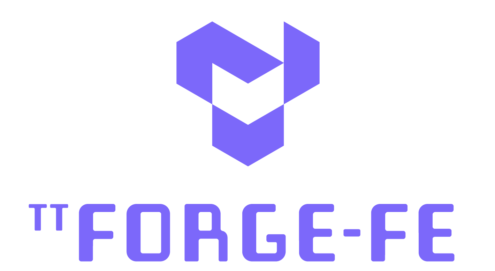

[![Tests][tests badge]][tests]
[![Codecov][codecov badge]][codecov]

<h1>

[Hardware](https://tenstorrent.com/cards/) | [Documentation](https://docs.tenstorrent.com/tt-forge-fe/) | [Discord](https://discord.gg/tenstorrent) | [Join Us](https://boards.greenhouse.io/tenstorrent?gh_src=22e462047us) | [Bounty $](https://github.com/tenstorrent/tt-forge-fe/issues?q=is%3Aissue%20state%3Aopen%20label%3Abounty)

</h1>

 

**TT-Forge FE** is a graph compiler designed to optimize and transform computational graphs for deep learning models, enhancing their performance and efficiency.

 

-----
# Quick Links
- [Getting Started / How to Run a Model](docs/src/getting_started.md)
- [Build](docs/src/build.md) - Use these instructions if you plan to do development work.

-----
# What is this Repo?

tt-forge-fe is a front end component within the broader tt-forge ecosystem, which is designed to compile and execute machine learning models on Tenstorrent hardware platforms like Wormhole and Blackhole. tt-forge-fe can ingest models from various machine learning frameworks including PyTorch, ONNX, and TensorFlow through the TVM Intermediate Representation (IR).

-----
# Getting Started Guide

You can run a demo using the [tt-forge-fe Getting Started](https://docs.tenstorrent.com/tt-forge-fe/getting-started.html) page.

-----
# Related Tenstorrent Projects
- [tt-forge-fe](https://github.com/tenstorrent/tt-forge-fe)
- [tt-xla](https://github.com/tenstorrent/tt-xla)
- [tt-torch](https://github.com/tenstorrent/tt-torch)
- [tt-mlir](https://github.com/tenstorrent/tt-mlir)
- [tt-metalium](https://github.com/tenstorrent/tt-metal)
- [tt-tvm](https://github.com/tenstorrent/tt-tvm)

# Tenstorrent Bounty Program Terms and Conditions
This repo is a part of Tenstorrent’s bounty program. If you are interested in helping to improve tt-forge, please make sure to read the [Tenstorrent Bounty Program Terms and Conditions](https://docs.tenstorrent.com/bounty_terms.html) before heading to the issues tab. Look for the issues that are tagged with both “bounty” and difficulty level!
- - -

[codecov]: https://codecov.io/gh/tenstorrent/tt-forge-fe
[tests]: https://github.com/tenstorrent/tt-forge-fe/actions/workflows/on-push.yml?query=branch%3Amain
[codecov badge]: https://codecov.io/gh/tenstorrent/tt-forge-fe/graph/badge.svg
[tests badge]: https://github.com/tenstorrent/tt-forge-fe/actions/workflows/on-push.yml/badge.svg?query=branch%3Amain
