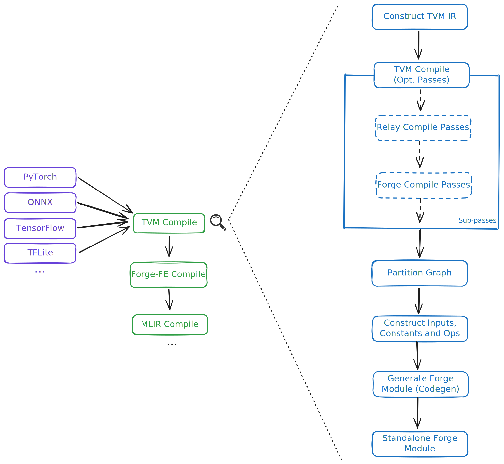
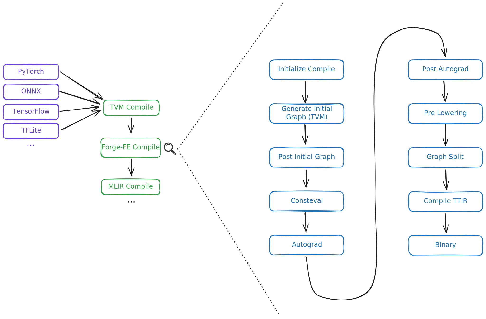

# Architecture Overview

TT-Forge is a comprehensive compiler designed to facilitate the development and optimization of machine learning models. It encompasses various components, each serving a specific purpose in the compiling and running machine learning pipelines. This document provides an overview of the key components with focus on [TT-Forge-FE](https://github.com/tenstorrent/tt-forge-fe).

### Table of contents
- [TT-Forge Overview](#tt-forge-overview)
- [TT-TVM Overview](#tt-tvm-overview)
   - [TVM IR](#tvm-ir)
   - [TVM Compile](#tvm-compile)
     - [Relay Compile Passes](#relay-compile-passes)
     - [Forge Compile Passes](#forge-compile-passes)
   - [Partition Graph](#partition-graph)
   - [Construct Inputs, Constants and Ops](#construct-inputs-constants-and-ops)
   - [Generate Forge-FE Module](#generate-forge-fe-module)
   - [Standalone Forge-FE Module](#standalone-forge-fe-module)
- [TT-Forge-FE Overview](#tt-forge-fe-overview)
   - [Initialize Compile](#initialize-compile)
   - [Generate Initial Graph (TT-TVM)](#generate-initial-graph-tt-tvm)
   - [Post Initial Graph passes](#post-initial-graph-passes)
   - [Consteval](#consteval)
   - [Autograd](#autograd)
   - [Post Autograd](#post-autograd)
   - [Pre Lowering](#pre-lowering)
   - [Graph Split](#graph-split)
   - [Compiler TTIR](#compiler-ttir)
   - [Output Binary](#output-binary)

## TT-Forge Overview

## TT-TVM Overview

### TVM IR

Coming soon!

### TVM Compile

Coming soon!

#### Relay Compile Passes

Coming soon!

#### Forge Compile Passes

Coming soon!

### Partition Graph

Coming soon!

### Construct Inputs, Constants and Ops

Coming soon!

### Generate Forge-FE Module

Coming soon!

### Standalone Forge-FE Module

Coming soon!

## TT-Forge-FE Overview

### Initialize Compile

Coming soon!

### Generate Initial Graph (TT-TVM)

Coming soon!

### Post Initial Graph passes

Coming soon!

### Consteval

Coming soon!

### Autograd

Coming soon!

### Post Autograd

Coming soon!

### Pre Lowering

Coming soon!

### Graph Split

Coming soon!

### Compiler TTIR

Coming soon!

### Output Binary

Coming soon!
