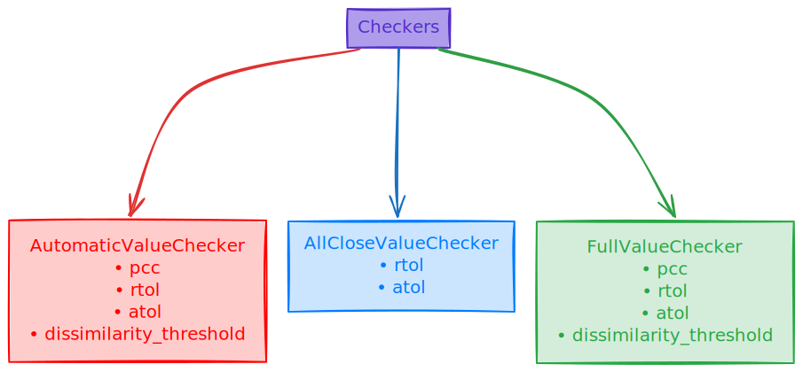

# Verification

## General Overview

When comparing our `compiled model` with the `framework model` (e.g., `PyTorch` model running on host), we aim to verify whether the output from the `compiled model` is sufficiently similar to the output from the `framework model` (where required degree of similarity is configurable).

So generally we want to perform the following steps:
1. Create a framework model.
2. Run a forward pass through the framework model.
3. Compile the framework model using `Forge`.
4. Run a forward pass through the compiled model.
5. Compare the outputs.

Most of the above steps `verify()` function does for us:
- Handles forward passes for both framework and compiled models
- Compares results using a combination of comparison methods
- Supports customization through the `VerifyConfig` class.

**Example of usage**
```python
def test_add():

	class Add(nn.Module):
		def __init__(self):
			super().__init__()

		def forward(self, a, b):
			return a + b


	inputs = [torch.rand(2, 32, 32), torch.rand(2, 32, 32)]

	framework_model = Add()
	compiled_model = forge.compile(framework_model, sample_inputs=inputs)

	verify(inputs, framework_model, compiled_model)
```

**Notes:**
- If you only want to compile model and perform forward pass without comparing outputs you can just:
```python
framework_model = Add()
compiled_model = forge.compile(framework_model, sample_inputs=inputs)

fw_out = framework_model(*inputs)
co_out = compiled_model(*inputs)
```

## Verify Config Overview

If `VerifyConfig` isn't passed as a param, default one will be used. Currently through `VerifyConfig` you can disable/enable:

| Feature                           | Name                | Enabled (default) |
|-----------------------------------|---------------------|:-----------------:|
| Verification as a method          | `enabled`           | `True`            |
| Number of output tensors check    | `verify_size`       | `True`            |
| Output tensor data type check     | `verify_dtype`      | `True`            |
| Output tensor shape check         | `verify_shape`      | `True`            |


For more information about `VerifyConfig` you can check `forge/forge/verify/config.py`.

**Example of usage**
```python
framework_model = Add()
compiled_model = forge.compile(framework_model, sample_inputs=inputs)

verify(inputs, framework_model, compiled_model, VerifyConfig(verify_dtype=False))
```
</br>

Besides that, config also includes value checker. There are 3 types of checker:
- `AutomaticValueChecker` **(default)**
- `AllCloseValueChecker`
- `FullValueChecker`

For more information about **Checkers** you can look at `forge/forge/verify/value_checkers.py`.

<br/>
<br/>




### AutomaticValueChecker

This checker performs tensor checks based on the **shape** and **type** of tensor (e.g. for scalars it will perform `torch.allclose` as `pcc` shouldn't be applied to the scalars)

For this checker you can set:
- `pcc`
- `rtol`
- `atol`
- `dissimilarity_threshold`

**Example of usage:**
```python
# default behavior
verify(inputs, framework_model, compiled_model)
# this will result same as the default behavior
verify(inputs, framework_model, compiled_model, VerifyConfig(value_checker=AutomaticValueChecker())
# setting pcc and rtol
verify(inputs, framework_model, compiled_model, VerifyConfig(value_checker=AutomaticValueChecker(pcc=0.95, rtol=1e-03)))
```

### AllCloseValueChecker

This checker checks tensors using `torch.allclose` method.

For this checker you can set:
- `rtol`
- `atol`

**Example of usage:**
```python
# setting allclose checker with default values
verify(inputs, framework_model, compiled_model, VerifyConfig(value_checker=AllCloseValueChecker()))
# setting allclose checker with custom values
verify(inputs, framework_model, compiled_model, VerifyConfig(value_checker=AllCloseValueChecker(rtol=1e-03)))

```

### FullValueChecker

This checker is combination of `AutomaticValueChecker` and `AllCloseValueChecker`.

For this checker you can set:
- `pcc`
- `rtol`
- `atol`
- `dissimilarity_threshold`

**Examples of usage:**
```python
# setting full checker with default values
verify(inputs, framework_model, compiled_model, VerifyConfig(value_checker=FullValueChecker())
# setting full checker with custom values
verify(inputs, framework_model, compiled_model, VerifyConfig(value_checker=FullValueChecker(pcc=0.95, rtol=1e-03)))
```
