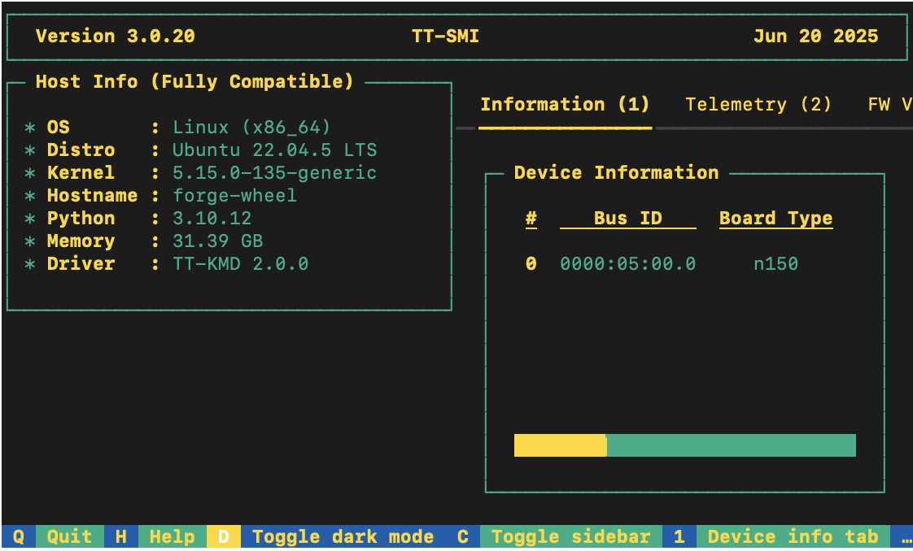

# Getting Started 
This document walks you through how to set up TT-Forge-FE. TT-Forge-FE is a framework agnostic frontend that can convert any model to a generic Intermediate Representation (IR) that can then be converted to a Tenstorrent specific IR for use with Tenstorrent hardware. This is the main Getting Started page. There are two additional Getting Started pages depending on what you want to do. They are all described here, with links provided to each. 

The following topics are covered:

* [Setup Options](#setup-options)
* [Configuring Hardware](#configuring-hardware)
* [Installing a Wheel and Running an Example](#installing-a-wheel-and-running-an-example)
* [Other Setup Options](#other-set-up-options)
    * [Using a Docker Container to Run an Example](getting_started_docker.md)
    * [Building From Source](getting_started_build_from_source.md) 
* [Where to Go Next]

> **NOTE:** If you encounter issues, please request assistance on the
>[TT-Forge-FE Issues](https://github.com/tenstorrent/tt-forge-fe/issues) page.

## Setup Options 
TT-Forge-FE can be used to run models from any framework. Because TT-Forge-FE is open source, you can also develop and add features to it. Setup instructions differ based on the task. You have the following options, listed in order of difficulty: 
* [Installing a Wheel and Running an Example](#installing-a-wheel-and-running-an-example) - You should choose this option if you want to run models. 
* [Using a Docker Container to Run an Example](getting_started_docker.md) - Choose this option if you want to keep the environment for running models separate from your existing environment. 
* [Building from Source](getting_started_build_from_source.md) - This option is best if you want to develop TT-Forge-FE further. It's a more complex process you are unlikely to need if you want to stick with running a model. 

## Configuring Hardware
Before setup can happen, you must configure your hardware. This section of the walkthrough shows you how to do a quick setup using TT-Installer. 

1. Configure your hardware with TT-Installer:

```bash
/bin/bash -c "$(curl -fsSL https://github.com/tenstorrent/tt-installer/releases/latest/download/install.sh)"
```

> **NOTE:** This walkthrough assumes that you use the [Quick Installation]
> (https://docs.tenstorrent.com/getting-started/README.html#quick-installation) instructions for set up.

2. Reboot your machine. 

3. Please ensure that after you run this script, after you complete reboot, you activate the virtual environment it sets up - ```source ~/.tenstorrent-venv/bin/activate```.

4. After your environment is running, to check that everything is configured, type the following: 

```bash
tt-smi
```

You should see the Tenstorrent System Management Interface. It allows you to view real-time stats, diagnostics, and health info about your Tenstorrent device. 



## Installing a Wheel and Running an Example

This section walks you through downloading and installing a wheel. You can install the wheel wherever you would like if it's for running a model. 

1. Make sure you are in an active virtual environment. This walkthrough uses the same environment you activated to look at TT-SMI in the [Configuring Hardware](#configuring-hardware) section.

2. Navigate to the [Tenstorrent Nightly Releases](https://github.com/tenstorrent/tt-forge/releases) page.

3. For this walkthrough, TT-Forge-FE is used. You need to install two wheels for set up, **forge** and **tvm**. Scroll down the releases page until you see the latest release for **tt-forge-fe nightly**. 

4. Go to the bottom of the section for your release and click on the triangle next to **Assets**. You are presented with two installable wheels, one for **tt_forge_fe** and one for **tt_tvm**. You can also download the source code for everything as a **.zip** or a **tar.gz** file. 

The links listed in this walkthrough are taken from the releases page as an example, however for the most current results get the links from the [Tenstorrent Nightly Releases](https://github.com/tenstorrent/tt-forge/releases) page. Here are the example links for install:

```bash
pip install https://github.com/tenstorrent/tt-forge/releases/download/nightly-0.1.0.dev20250514060212/forge-0.1.0.dev20250514060212-cp310-cp310-linux_x86_64.whl
```

```bash
pip install  https://github.com/tenstorrent/tt-forge/releases/download/nightly-0.1.0.dev20250509060216//tvm-0.1.0.dev20250509060216-cp310-cp310-linux_x86_64.whl
```

5. To test that everything is running correctly, try an example model. You can use nano or another text editor to paste this code into a file named **forge_example.py** and then run it from the terminal. You should still have your virtual environment running after installing the wheels when running this example: 

```python
import torch
import forge

class Add(torch.nn.Module):
  def __init__(self):
    super().__init__()

  def forward(self, a, b):
    return a + b

a = torch.rand(size=(2, 32, 32))
b = torch.rand(size=(2, 32, 32))

framework_module = Add()
compiled_model = forge.compile(framework_module, sample_inputs=[a, b])

out = compiled_model(a, b)

print("compiled output:", out)
```

6. You have now set up the latest wheels for TT-Forge-FE, and can run any models you want inside your virtual environment. 

## Other Set up Options 
If you want to keep your environment completely separate in a docker container, or you want to develop TT-Forge-FE further, this section links you to the pages with those options: 

* [Setting up a Docker Container](getting_started_docker.md) - keep everything for running models in a container
* [Building from Source](getting_started_build_from_source.md) - set up so you can develop TT-Forge-FE 

## Where to Go Next

Now that you have set up TT-Forge-FE, you can compile and run your own models. See [Running a Custom Model](running_a_custom_model.md) for more details.


